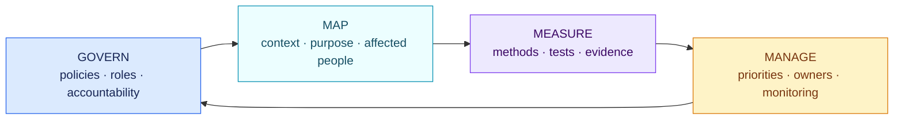
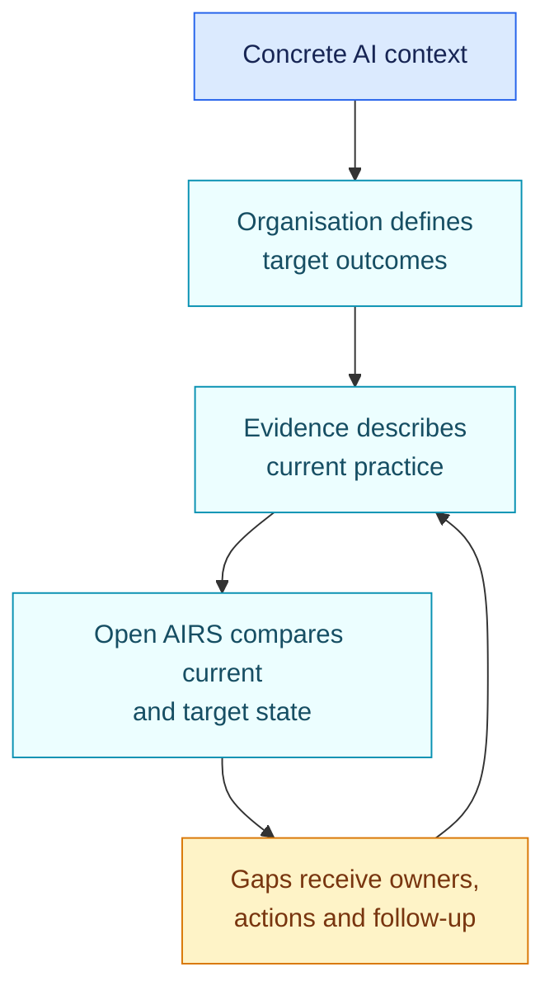

<!-- SPDX-License-Identifier: CC-BY-SA-4.0 -->

# NIST AI RMF core outcomes · 1.0.0

[Lire en français](README.fr.md)

This pack checks whether top-level practices exist across the four functions of
NIST AI Risk Management Framework 1.0. It also records whether the NIST
Generative AI Profile has been considered when generative AI is in scope.

NIST AI RMF is voluntary. Findings are maturity and evidence gaps, not legal
non-compliance.

## At a glance

| | |
| --- | --- |
| Authority | Voluntary framework published by NIST |
| Assessed objects | AI system, AI platform, configured application, concrete use, organisation |
| Sources | NIST AI 100-1 and NIST AI 600-1 |
| Reviewed | 29 August 2026 |
| Rules encoded | 5 |
| Main outputs | GOVERN, MAP, MEASURE and MANAGE gaps; Generative AI Profile consideration gap |

## The four functions

The functions are designed to work together and to be revisited as context and
risk change.



## Questions encoded in this baseline

| Function | Evidence-backed question |
| --- | --- |
| GOVERN | Are AI risk policies, roles and accountability defined? |
| MAP | Are context, intended purpose, affected people and impacts documented? |
| MEASURE | Are risks and trustworthiness characteristics measured with documented methods? |
| MANAGE | Are prioritised risk responses assigned and tracked? |
| Generative AI | If the system uses generative AI, has NIST AI 600-1 been considered for the relevant context? |

The Generative AI Profile is not treated as a yes/no certification. A matched
gap asks the organisation to select the relevant risks and actions for its
actual context.

## How a profile becomes actionable



This public pack supplies a small common baseline. The organisation still
defines its target profile, risk tolerance, measurements and responsible
owners in its own governed configuration.

## Coverage and known gaps

Encoded coverage:

- readiness at the top level of GOVERN, MAP, MEASURE and MANAGE;
- a marker for Generative AI Profile consideration.

Not yet encoded:

- every category, subcategory and suggested action;
- organisation-specific target profiles and risk tolerances;
- measurements, test protocols and thresholds;
- sector or use-case profiles.

AI RMF 1.0 is under revision as of the review date. A future NIST release must
be published as a new pack version and impact-tested. It must not silently
replace this pinned source.

## Official sources

- [NIST AI Risk Management Framework 1.0](https://doi.org/10.6028/NIST.AI.100-1)
- [NIST Generative AI Profile, NIST AI 600-1](https://doi.org/10.6028/NIST.AI.600-1)
- [NIST AI RMF official page and revision status](https://www.nist.gov/itl/ai-risk-management-framework)

Open [`pack.json`](pack.json) only when you need the machine-readable facts and
conditions.

## Validate the pack

```bash
open-airs validate-pack packs/nist-ai-rmf/1.0.0/pack.json
```
