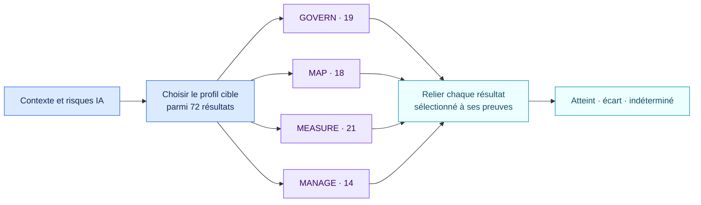

<!-- SPDX-License-Identifier: CC-BY-SA-4.0 -->

# NIST AI RMF 1.0, résultats complets du Core · 1.1.0

[Read in English](README.md)

Ce pack expose les 72 résultats du Core NIST AI RMF 1.0 en vigueur. Une
organisation sélectionne d’abord ceux de son profil cible. Seuls les résultats
sélectionnés peuvent produire un écart ou une réponse indéterminée.

## Fonctionnement du profil

`nist.airmf.selected_outcomes` contient les identifiants officiels retenus,
par exemple `GOVERN 1.1` ou `MEASURE 2.5`. Chaque résultat sélectionné possède
un fait booléen relié à ses preuves. Les autres restent hors évaluation. Une
sélection absente produit un constat unique sur le profil.

Le profil Generative AI est une publication NIST distincte. Le pack consigne
si ses risques et actions pertinents ont été sélectionnés. Il ne réduit pas ce
profil à un contrôle binaire.

## Sources officielles

- [NIST AI RMF 1.0](https://doi.org/10.6028/NIST.AI.100-1)
- [Playbook NIST AI RMF](https://airc.nist.gov/airmf-resources/airmf/5-sec-core/)
- [Profil Generative AI NIST AI 600-1](https://doi.org/10.6028/NIST.AI.600-1)
- [État du référentiel](https://www.nist.gov/itl/ai-risk-management-framework)

Ce pack porte un référentiel volontaire. Ses constats décrivent des écarts de
profil, sans conclure à une non-conformité juridique ni à une certification.
