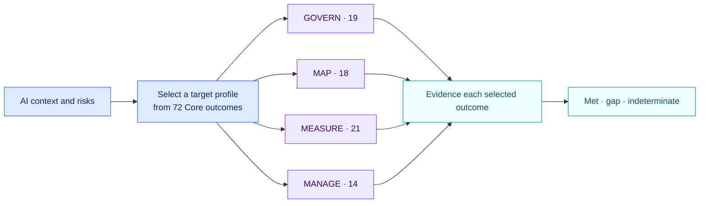

<!-- SPDX-License-Identifier: CC-BY-SA-4.0 -->

# NIST AI RMF 1.0 full Core outcomes · 1.1.0

[Lire en français](README.fr.md)

This pack exposes all 72 outcomes of the current NIST AI RMF 1.0 Core. An
organisation first selects the outcomes that belong to its target profile.
Only selected outcomes can produce a gap or an indeterminate result.

## How the profile works

`nist.airmf.selected_outcomes` contains the official identifiers selected for
the target, such as `GOVERN 1.1` or `MEASURE 2.5`. Each selected outcome has a
separate evidence-backed boolean fact. Unselected outcomes remain outside the
assessment. A missing selection produces one profile finding.

The Generative AI Profile is a separate NIST publication. This pack records
whether its relevant risks and suggested actions have been selected; it does
not treat that publication as one binary control.

## Official sources

- [NIST AI RMF 1.0](https://doi.org/10.6028/NIST.AI.100-1)
- [NIST AI RMF Playbook](https://airc.nist.gov/airmf-resources/airmf/5-sec-core/)
- [NIST AI 600-1 Generative AI Profile](https://doi.org/10.6028/NIST.AI.600-1)
- [NIST framework status](https://www.nist.gov/itl/ai-risk-management-framework)

This is a voluntary framework pack. Its findings are profile gaps, with no
claim of legal non-compliance or certification.
