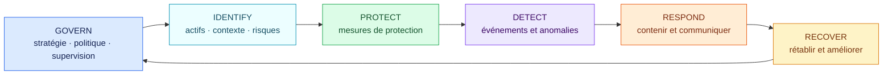
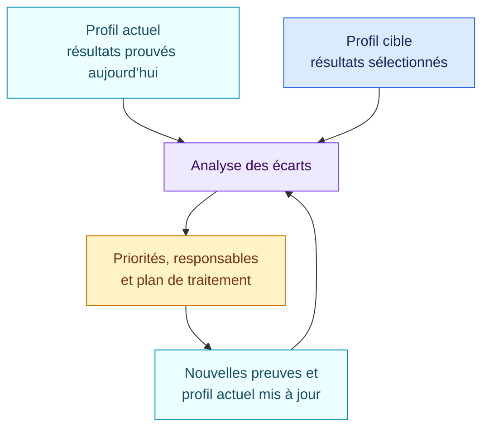

<!-- SPDX-License-Identifier: CC-BY-SA-4.0 -->

# Socle fonctionnel du NIST Cybersecurity Framework 2.0

[Read in English](README.md)

Ce pack fournit une vérification de premier niveau sur les six fonctions du
NIST Cybersecurity Framework 2.0. Il sert de point de départ à un profil actuel
et un profil cible gouvernés. Il ne couvre pas tout le CSF Core.

Le NIST CSF est volontaire. Les résultats décrivent des écarts de profil, pas
une non-conformité juridique.

## En bref

| | |
| --- | --- |
| Autorité | Référentiel volontaire publié par le NIST |
| Objets évalués | Organisation, service, plateforme IA, système d’IA |
| Source | NIST CSWP 29, Cybersecurity Framework 2.0 |
| Dernière revue | 29 août 2026 |
| Règles encodées | 6 |
| Principaux résultats | Écarts de premier niveau pour GOVERN, IDENTIFY, PROTECT, DETECT, RESPOND et RECOVER |

## Les six fonctions

Les fonctions s’appliquent en parallèle. GOVERN oriente les cinq autres ; les
incidents et la reprise alimentent ensuite la gouvernance et les cibles.



## Ce que demande ce socle

Pour chaque fonction, le pack attend une réponse prouvée : les résultats cibles
sélectionnés par l’organisation sont-ils atteints pour cet objet et ce contexte ?

| Fonction | Exemples de preuves attendues hors de ce pack minimal |
| --- | --- |
| GOVERN | Stratégie de risque, politiques, rôles, supervision et gouvernance de la chaîne d’approvisionnement |
| IDENTIFY | Inventaire des actifs, contexte métier, analyse de risque et priorités d’amélioration |
| PROTECT | Identités, accès, sécurité des données, résilience des plateformes et sensibilisation |
| DETECT | Supervision, analyse des anomalies et processus de détection |
| RESPOND | Gestion, analyse, communication, atténuation et notification des incidents |
| RECOVER | Plans de reprise, restauration, communication et retour d’expérience |

Le fait binaire de ce pack alpha n’a de sens que si un profil distinct, propre
à l’organisation, définit les résultats sous-jacents qui composent la cible et
leurs preuves.

## Profils actuel et cible



Open AIRS conserve séparément la source NIST, le profil cible de l’organisation et
la voie de traitement appliquée aux écarts.

## Couverture et limites connues

Le pack encode :

- un fait de préparation et une règle d’écart pour chacune des six fonctions.

Il n’encode pas encore :

- les catégories et sous-catégories du CSF ;
- le profil actuel ou cible d’une organisation ;
- les Implementation Tiers ;
- les Informative References et profils sectoriels ;
- les mesures et preuves attendues pour chaque résultat.

Ce pack est donc un socle d’intégration et un exemple de format. Un profil de
production doit sélectionner les résultats CSF pertinents. Une phrase générale
ne suffit pas à établir qu’une fonction entière est satisfaite.

## Sources officielles

- [NIST Cybersecurity Framework 2.0, NIST CSWP 29](https://doi.org/10.6028/NIST.CSWP.29)
- [Profils organisationnels du NIST CSF](https://www.nist.gov/cyberframework/profiles)

Ouvrez [`pack.json`](pack.json) uniquement pour les faits et conditions de
premier niveau interprétables par la machine.

## Valider le pack

```bash
open-airs validate-pack packs/nist-csf/2.0.0/pack.json
```
