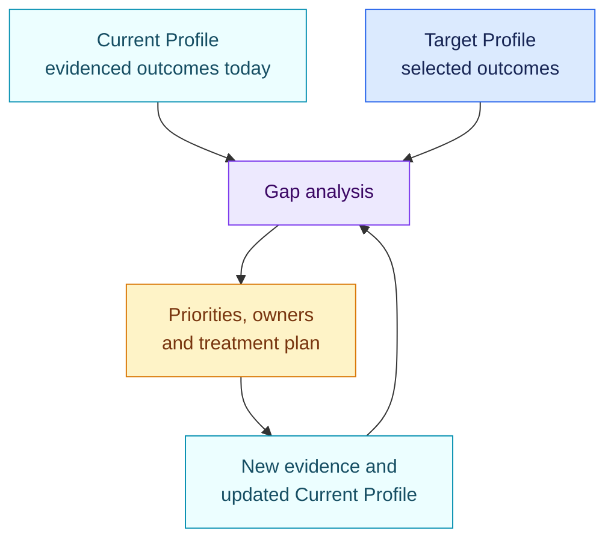

<!-- SPDX-License-Identifier: CC-BY-SA-4.0 -->

# NIST Cybersecurity Framework 2.0 function baseline

[Lire en français](README.fr.md)

This pack provides a top-level gap check across the six functions of NIST
Cybersecurity Framework 2.0. It is intended as a starting point for a governed
Current and Target Profile, not as a complete implementation of the CSF Core.

NIST CSF is voluntary. Findings describe profile gaps, not legal
non-compliance.

## At a glance

| | |
| --- | --- |
| Authority | Voluntary framework published by NIST |
| Assessed objects | Organisation, service, AI platform, AI system |
| Source | NIST CSWP 29, Cybersecurity Framework 2.0 |
| Reviewed | 29 August 2026 |
| Rules encoded | 6 |
| Main outputs | Top-level gaps for GOVERN, IDENTIFY, PROTECT, DETECT, RESPOND and RECOVER |

## The six functions

The functions are concurrent. GOVERN informs the other five, while lessons
from incidents and recovery update governance and target outcomes.


## What this baseline asks

For each function, the pack expects one evidence-backed answer: are the
organisation’s selected target outcomes met for this object and context?

| Function | Typical evidence outside this thin pack |
| --- | --- |
| GOVERN | Risk strategy, policies, roles, oversight and supply-chain governance |
| IDENTIFY | Asset inventory, business context, risk assessment and improvement priorities |
| PROTECT | Identity, access, data security, platform resilience and awareness measures |
| DETECT | Monitoring, anomaly analysis and event-detection processes |
| RESPOND | Incident management, analysis, communication, mitigation and reporting |
| RECOVER | Recovery plans, restoration, communication and lessons learned |

The binary fact in this alpha pack is only useful when a separate
organisation-owned profile defines which underlying outcomes count as the
target and points to their evidence.

## Current and Target Profiles



Open AIRS keeps the framework source, the organisation’s Target Profile and the
resulting treatment route as distinct versioned objects.

## Coverage and known gaps

Encoded coverage:

- one top-level readiness fact and gap rule for each CSF 2.0 function.

Not yet encoded:

- CSF categories and subcategories;
- an organisation-specific Current or Target Profile;
- Implementation Tiers;
- Informative References and sector profiles;
- measurements and evidence requirements for individual outcomes.

This pack is therefore an integration baseline and example. A production
profile should select the relevant CSF outcomes. A general statement does not
establish completion of an entire function.

## Official sources

- [NIST Cybersecurity Framework 2.0, NIST CSWP 29](https://doi.org/10.6028/NIST.CSWP.29)
- [NIST CSF organisational profiles](https://www.nist.gov/cyberframework/profiles)

Open [`pack.json`](pack.json) only when you need the machine-readable top-level
facts and conditions.

## Validate the pack

```bash
open-airs validate-pack packs/nist-csf/2.0.0/pack.json
```
