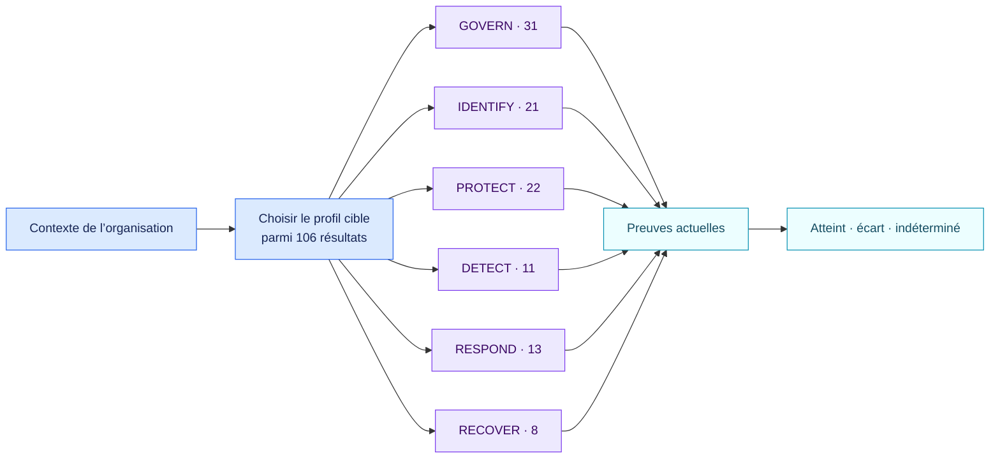

# NIST Cybersecurity Framework 2.0, Core complet · 2.1.0

[Read in English](README.md)

Ce pack expose les 106 résultats actuels des sous-catégories CSF 2.0. Une
organisation construit son profil cible en sélectionnant ceux qui correspondent
à sa mission, ses exigences, son appétence au risque et son environnement de
menace.

## Évaluation limitée au profil choisi

`nist.csf.selected_subcategories` contient des identifiants tels que
`GV.OC-03` ou `PR.AA-01`. Chaque identifiant retenu possède son propre fait
relié à des preuves. Les autres résultats ne produisent aucun écart. Une
sélection absente produit un constat unique sur le profil.

Le pack conserve le caractère non prescriptif du CSF. Les niveaux de mise en
œuvre, exemples et références peuvent être ajoutés dans un profil propre à
l’organisation.

## Sources officielles

- [NIST Cybersecurity Framework 2.0](https://doi.org/10.6028/NIST.CSWP.29)
- [Profils organisationnels NIST CSF](https://www.nist.gov/cyberframework/profiles)

Ce pack porte un référentiel volontaire. Ses constats décrivent des écarts de
profil, sans conclure à une non-conformité juridique ni à une certification.
