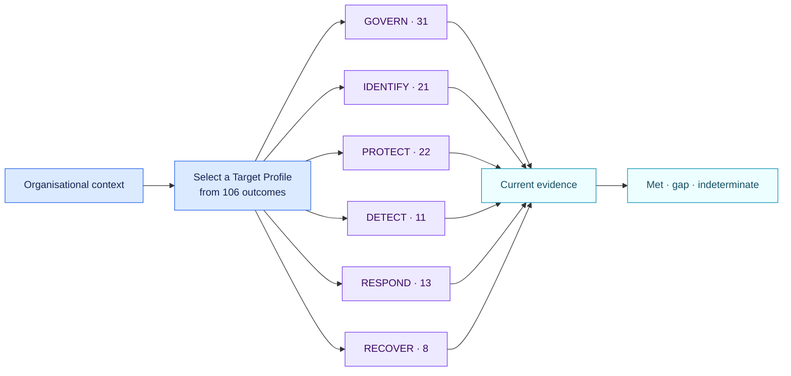

<!-- SPDX-License-Identifier: CC-BY-SA-4.0 -->

# NIST Cybersecurity Framework 2.0 full Core · 2.1.0

[Lire en français](README.fr.md)

This pack exposes all 106 current CSF 2.0 subcategory outcomes. An organisation
builds a Target Profile by selecting the outcomes relevant to its mission,
requirements, risk appetite and threat environment.

## Profile-scoped assessment

`nist.csf.selected_subcategories` contains identifiers such as `GV.OC-03` or
`PR.AA-01`. Every selected identifier has a separate evidence-backed fact.
Unselected outcomes produce no gap. A missing target selection produces one
profile finding.

The pack keeps CSF outcomes non-prescriptive. Implementation Tiers,
implementation examples and informative references can be added through a
separate organisational profile.

## Official sources

- [NIST Cybersecurity Framework 2.0](https://doi.org/10.6028/NIST.CSWP.29)
- [NIST CSF Organizational Profiles](https://www.nist.gov/cyberframework/profiles)

This is a voluntary framework pack. Its findings are profile gaps, with no
claim of legal non-compliance or certification.
