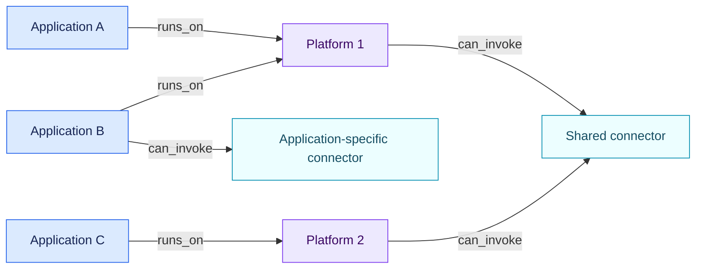

<!-- SPDX-License-Identifier: CC-BY-SA-4.0 -->

# Object graph

Open AIRS keeps one governance inventory and allows each rule pack to
project the legal or methodological view it needs. An item can belong in the
inventory without being an AI system in law.

## Core object types

| Type | Meaning | Typical example |
| --- | --- | --- |
| `ai_system` | A candidate AI system considered as a deployable whole | A fraud-detection system |
| `ai_platform` | A runtime or tenant that exposes models, controls and connectors | An enterprise AI workspace |
| `configured_ai_application` | An application configured on a platform, often called an “agent” by vendors | A recruiting assistant |
| `skill` | A passive package of instructions and optional resources | A CV-screening skill |
| `connector` | A capability exposed by a runtime to read or act on another system | HRIS read/write access |
| `model` | A model made available to a platform or system | A language model endpoint |
| `ai_use` | A concrete intended purpose in a business and operational context | Screening applicants for a role |
| `organization` | A legal or operational actor | A deployer or provider |
| `provider` | A supplier or value-chain actor | A hosted-model provider |
| `service` | A governed non-AI service | A managed hosting service |
| `contract` | A contract submitted to a non-AI rule pack | A fictional SaaS agreement |

Extensions may use `generic` until they register a stable type in a future
schema version.

An object can cite evidence directly before any semantic fact exists. This is
how a newly imported prompt, contract or configuration becomes available to
the extraction call. Facts and relations can cite the same evidence records.

## Composition and inheritance

Relations form a directed graph. The reference examples use:

- `runs_on`: configured application → platform;
- `loads_skill`: configured application → skill;
- `can_invoke`: configured application or platform → connector;
- `offers_model`: platform → model made available;
- `uses_model`: configured application or AI system → model actually selected;
- `implemented_by`: concrete use → configured application or AI system;
- `operated_by`: system, platform, application or use → organization;
- `provided_by`: component or service → provider.

The validator checks the source and target types of every reference relation
above. Extension relation names remain allowed for forward compatibility, but
they carry no signature guarantee until they are registered here.

`offers_model` and `uses_model` answer different questions: a platform can
offer several models while a configured application uses one of them for a
given period. Model-dependent facts should be read from the model the
application actually uses.

For the optional LLM call, the reference orchestrator follows outgoing
relations for up to three steps from the assessment target. This includes the
usual use → application → platform → shared-connector path and avoids sending
unrelated applications that happen to run on the same platform. The rule
engine has no implicit three-step rule: it follows the explicit paths declared
by each pack.

## Connector scope

Connector scope is expressed by the source of `can_invoke`:

- platform → connector exposes a capability to applications on that platform;
- several platforms → one connector models a shared company capability;
- application → connector models a capability reserved for that application.

Availability and execution remain distinct. `can_invoke` records a capability
exposed by the captured configuration. Execution logs require separate evidence.
If permissions, credentials, actions or human gates differ between installations,
each installation is a separate connector object. A shared catalogue identifier
can be retained in `external_ids`.

The complete example is in
[`examples/connector-topologies`](../examples/connector-topologies/README.md).

A skill never invokes a connector. A runtime invokes a connector after an
application has selected an action and only within the runtime's permissions.
The graph can therefore show that a recruitment use combines a screening
skill with an outbound connector without pretending that the skill itself is
an autonomous system.

## Connector actions and derived composition facts

A connector can declare its exposed actions as one structured fact,
`connector.actions`, whose value is a list of entries:

| Field | Values | Meaning |
| --- | --- | --- |
| `id` | free string | Stable action identifier, e.g. `send_rejection_email` |
| `kind` | `read`, `send_internal`, `write`, `execute`, `delete`, `send_external` | What the action does to the target system |
| `approval` | `none`, `standing_user_authorization`, `per_conversation`, `per_action` | When a human approves the action |
| `enforced_by` | `connector`, `platform`, `none` | Where the approval gate is enforced |
| `bypassable` | boolean | Whether the gate can be bypassed |
| `target_criticality` | `standard`, `critical` | Sensitivity of the target system |

From these declarations the engine derives composition facts for the
assessment target before pack inheritance is applied, with
`provenance: "derived"` and the contributing connectors listed:

- `composition.can_send_external`;
- `composition.autonomous_external_send_possible`;
- `composition.engaging_action_approval_floor` (weakest approval across
  non-read actions).

The declaration is validated strictly at inventory validation: every entry
needs a string `id` and a listed `kind`, and the optional fields must carry
listed values and real booleans. A malformed value such as
`bypassable: "yes"` fails the import instead of being silently read as a
working human gate; platform-specific vocabularies are the job of import
adapters, which translate to this canonical form.

Derivation follows the captured snapshot only, with a three-valued reading
of each gate. Autonomy is a positive claim, so it needs positive grounds: a
permissive approval level, a bypassable or malformed gate, or an approval
that no technical mechanism imposes (a policy wish, not a demonstrable
control). A gate is demonstrable only when the declaration is complete: a
gated approval level, `enforced_by` set to `connector` or `platform`, and
`bypassable` explicitly false. An enforced gate whose bypassability is
simply not stated proves neither, so the derived autonomy fact stays
`unknown` instead of becoming an established exposure or a reassurance.
A negative conclusion, such as "no external send is possible", requires
every reachable connector to declare its actions; otherwise the derived
fact stays `unknown` as well.

Composition facts are the engine's own computation: the engine refuses an
assessment whose input facts already contain a `composition.*` fact, so a
declared value can never neutralise what the captured actions establish.
The correction path is the declaration itself. Derived facts otherwise win
over pack-declared inheritance.

This keeps the division of labour stable: the model reads intent, the
configuration proves capability and gating, and rules combine both.

## Explicit inheritance

There is no universal parent-to-child inheritance. Each pack declares the
facts that may propagate and the exact relation path. A direct known fact wins.
If two inherited sources disagree, the effective fact becomes `conflicted`.
The engine never resolves the conflict by guessing.

Final legal classifications do not propagate as ordinary facts. They are
recomputed for the target composition unless a future rule explicitly defines
a legally justified scoped propagation.
