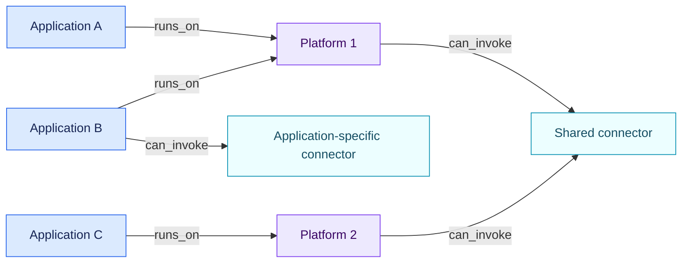

<!-- SPDX-License-Identifier: CC-BY-SA-4.0 -->

# Object graph

AIR Framework keeps one governance inventory and allows each rule pack to
project the legal or methodological view it needs. An item can belong in the
inventory without being an AI system in law.

## Core object types

| Type | Meaning | Typical example |
| --- | --- | --- |
| `ai_system` | A candidate AI system considered as a deployable whole | A fraud-detection system |
| `ai_platform` | A runtime or tenant that exposes models, controls and connectors | An enterprise AI workspace |
| `configured_ai_application` | An application configured on a platform, often called an “agent” by vendors | A recruiting assistant |
| `skill` | A passive package of instructions and optional resources | A CV-screening skill |
| `connector` | A capability exposed by a runtime to read or act on another system | HRIS read/write access |
| `model` | A model made available to a platform or system | A language model endpoint |
| `ai_use` | A concrete intended purpose in a business and operational context | Screening applicants for a role |
| `organization` | A legal or operational actor | A deployer or provider |
| `provider` | A supplier or value-chain actor | A hosted-model provider |
| `service` | A governed non-AI service | A managed hosting service |
| `contract` | A contract submitted to a non-AI rule pack | A fictional SaaS agreement |

Extensions may use `generic` until they register a stable type in a future
schema version.

An object can cite evidence directly before any semantic fact exists. This is
how a newly imported prompt, contract or configuration becomes available to
the extraction call. Facts and relations can cite the same evidence records.

## Composition and inheritance

Relations form a directed graph. The reference examples use:

- `runs_on`: configured application → platform;
- `loads_skill`: configured application → skill;
- `can_invoke`: configured application or platform → connector;
- `offers_model`: platform → model;
- `implemented_by`: concrete use → configured application or AI system;
- `operated_by`: system, platform or use → organization;
- `provided_by`: component or service → provider.

For the optional LLM call, the reference orchestrator follows outgoing
relations for up to three steps from the assessment target. This includes the
usual use → application → platform → shared-connector path and avoids sending
unrelated applications that happen to run on the same platform. The rule
engine has no implicit three-step rule: it follows the explicit paths declared
by each pack.

## Connector scope

Connector scope is expressed by the source of `can_invoke`:

- platform → connector exposes a capability to applications on that platform;
- several platforms → one connector models a shared company capability;
- application → connector models a capability reserved for that application.

Availability and execution remain distinct. `can_invoke` records a capability
exposed by the captured configuration. Execution logs require separate evidence.
If permissions, credentials, actions or human gates differ between installations,
each installation is a separate connector object. A shared catalogue identifier
can be retained in `external_ids`.

The complete example is in
[`examples/connector-topologies`](../examples/connector-topologies/README.md).

A skill never invokes a connector. A runtime invokes a connector after an
application has selected an action and only within the runtime's permissions.
The graph can therefore show that a recruitment use combines a screening
skill with an outbound connector without pretending that the skill itself is
an autonomous system.

## Explicit inheritance

There is no universal parent-to-child inheritance. Each pack declares the
facts that may propagate and the exact relation path. A direct known fact wins.
If two inherited sources disagree, the effective fact becomes `conflicted`.
The engine never resolves the conflict by guessing.

Final legal classifications do not propagate as ordinary facts. They are
recomputed for the target composition unless a future rule explicitly defines
a legally justified scoped propagation.
