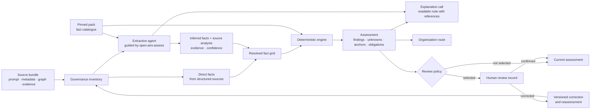
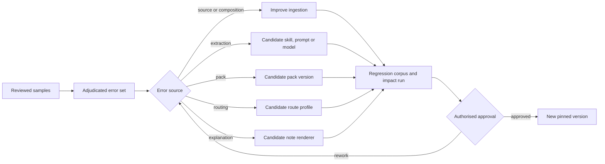

<!-- SPDX-License-Identifier: CC-BY-SA-4.0 -->

# Extraction, review and controlled improvement

Open AIRS separates semantic interpretation, deterministic evaluation and human
quality control. This separation allows an organisation to process a large
inventory without requiring a person to approve every object before the engine
runs.

## Runtime sequence

Structured sources can supply direct facts without a model. The extraction
agent handles fields that require semantic reading and makes bounded
judgements. It can recognise that
instructions rank candidates, that a configured application can send a message
or that a contract clause is ambiguous. It returns the proposed facts used by
the pack and a source-analysis note. Direct and inferred facts are
resolved into one grid before evaluation. The note records claims, evidence,
unknowns and cautions. It is an audit rationale, not a transcript of private
model reasoning.

The engine evaluates the fact grid with a pinned pack. It owns the reproducible
rule result, anchors and obligations. The explanation call receives the
extraction and engine results, then writes prose whose references are checked
locally. It cannot change a status or create a rule, anchor or obligation. An
organisation route is computed from the immutable findings as a separate step.

## The `open-airs-assess` skill

`open-airs-assess` is a portable instruction package for the extraction and
explanation calls. The Python rule engine does not call it. The optional
`open-airs qualify` command provides a reference orchestrator. A product
can implement the same interface with its own model gateway. The sequence is:

1. establish the target and composition;
2. read the selected packs and their fact catalogues;
3. produce an extraction record for semantic facts, source analysis and exact
   pack pins;
4. create a new inventory snapshot while retaining any conflict with reliable
   structured facts;
5. invoke the deterministic engine;
6. prepare the readable assessment note from the extraction and engine output;
7. reject the note if any cited fact, evidence item, rule or anchor is absent.

The `assess` and `assess-profile` commands start at step 5 when an inventory
already contains the required facts. The `qualify` command runs all seven
steps.

## Reference alpha boundary

| Included in this repository | Supplied by an integrating product |
| --- | --- |
| `open-airs-assess` instructions and versioned prompt templates | Secure source access and secrets management |
| OpenAI-compatible model client and two-call orchestrator | Provider selection, budget and regional controls |
| Extraction, assessment-note and review schemas | Durable database and access control |
| Direct and inferred fact resolution with visible conflicts | Organisation-specific source precedence rules when needed |
| Deterministic pack engine and traces | Review-selection policy, scheduler and reviewer interface |
| Versioned pack and route formats | Approval and activation workflow |

The client uses the OpenAI-compatible Chat Completions request shape and can
target different providers through environment variables. The framework ships
no provider key and selects no model by default. `assess` never invokes a
model; `qualify` does. No command selects a periodic sample on its own.

Each extraction stores the model id, provider label, model run id, complete
prompt hash, prompt-template version and every pack version and hash sent to
the model. The note stores the corresponding renderer metadata. Token usage is
retained when the provider returns it. These fields allow an auditor to
identify the exact protocol used for both calls.

## Review selection

Human review is controlled by an organisation-owned policy. Common selectors
include:

- findings that the organisation considers material;
- unknown, conflicted or low-confidence facts;
- a new model, extractor skill, pack, platform or connector configuration;
- drift detected between snapshots;
- a random or stratified quality sample.

Sampling should cover object type, platform, risk family, confidence band,
extractor version and time period. A purely random sample can miss rare but
material cases.

## Review records and corrections

A review record references the immutable assessment and states why the case was
selected. It can confirm, correct, dispute or leave unresolved a fact, finding
or analysis statement. A correction never edits the old assessment. It creates
new evidence, a new inventory snapshot or a candidate extractor, pack, route or
explanation version. The applicable tests and approval complete before a new
assessment becomes current.

The public schemas are:

- [`extraction.schema.json`](schemas/extraction.schema.json) for semantic fact
  proposals and source analysis;
- [`assessment-note.schema.json`](schemas/assessment-note.schema.json) for the
  readable case file and the references supporting each material statement;
- [`review.schema.json`](schemas/review.schema.json) for mandatory, targeted or
  sampled human review.

## Controlled learning loop

The framework does not mutate its doctrine from reviewer feedback during a
live run. Adjudicated errors become a versioned evaluation corpus. Candidate
changes pass regression tests and impact simulation, then an authorised person
publishes a new version.

Quality is measured on a defined population and period. Useful measures include
fact-level reviewer agreement, material false-negative rate, unknown rate,
anchor fidelity, explanation fidelity and drift by extractor version. A high
score on one sample does not establish permanent accuracy for future models,
regulations or uses.
