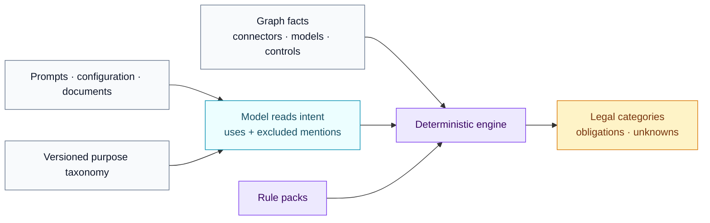

<!-- SPDX-License-Identifier: CC-BY-SA-4.0 -->

# Purpose and proposed uses

The purpose of a composition is the centre of every downstream legal
question. This chapter defines how a purpose is proposed, expressed and kept
auditable, without ever letting the vocabulary carry a legal conclusion.

## Why a dedicated layer

Reading a purpose out of prompts, configurations and documents is a semantic
task: it cannot be done deterministically. Everything after that reading can
be. The purpose layer is therefore the boundary between the model's judgement
and the rule engine, and it is recorded so a reviewer can challenge exactly
what the model understood.

## The proposed use

An extraction record may contain `proposed_uses`. Each entry captures one
active purpose the sources establish:

| Field | Meaning |
| --- | --- |
| `purpose_statement` | One readable sentence: what the composition is for |
| `purpose_tags` | Tag ids from the pinned purpose taxonomy |
| `material_tasks` | The concrete operations performed |
| `affected_people` | Who is materially affected, in plain words |
| `decision_influence` | `none`, `informative`, `material` or `determinative` |
| `evidence` | Evidence ids that establish the use |
| `confidence` | Extraction confidence, required for model output |
| `alternative_interpretations` | Competing readings a reviewer should see |

A composition may carry several uses. Tags come only from a **versioned
taxonomy** pinned in the record (`taxonomy.id`, `taxonomy.version`), so a tag
keeps one meaning over time and packs can map tags to legal categories
without guessing. Tags are neutral activity labels: `candidate_selection`
describes an activity; only a rule pack may conclude what that activity means
under a given law.

## Role and polarity: the guardrail rule

Before proposing a use, every relevant passage is classified. Only active
purposes become uses. Everything else is recorded as an `excluded_mention`:

| Classification | Meaning |
| --- | --- |
| `prohibited_by_instructions` | The instructions forbid the activity |
| `guardrail` | The instructions limit or condition the activity |
| `example_reference` | The activity is merely cited or illustrated |
| `capability_only` | Only the configuration shows the capability; no instruction requests it |

This is the structural answer to a classic false positive: a prompt that
says "never screen CVs" mentions CV screening in order to exclude it. The
mention must appear as `prohibited_by_instructions`, with its evidence, and
no recruitment use may be created from it. Conversely, a guardrail on an
active use ("never send the rejection without recruiter confirmation")
does not erase the use, does not prove the guarded activity is absent
elsewhere, and does not prove that a runtime control enforces it. Runtime
controls are established by configuration facts, never by prompt text.

## From proposal to registry object

A clear, well-evidenced proposal may be materialised as an `ai_use` object
without waiting for a human, provided the record keeps:

- the origin (`llm-proposed`), model, prompt version and confidence;
- the evidence trail and the taxonomy pin;
- a review state, so exception-based and sampled review remain possible.

Ambiguous, conflicting or low-confidence proposals are routed to review
instead. Nothing active ever changes silently: a correction produces a new
version, never an in-place edit.

## Division of labour, restated

The model proposes purposes and facts with evidence. The engine derives
capability facts from the captured configuration and applies versioned rules.
Neither replaces the other, and both leave a trace a reviewer can contest.
